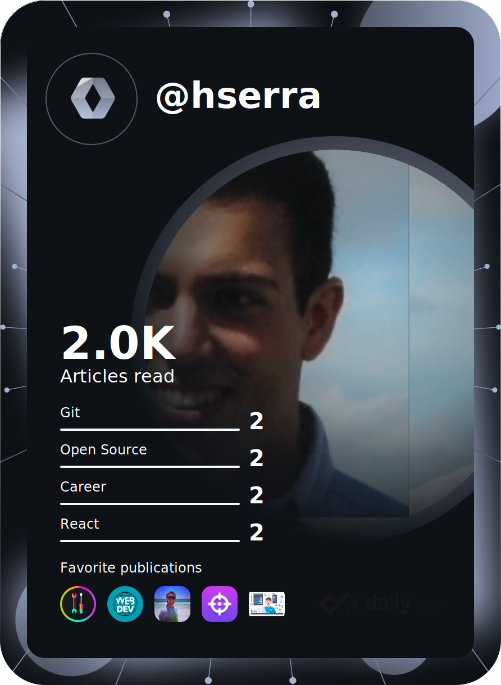

<!--  -->

### Hi there 👋, I'm Hugo.

I'm a Software Engineer and Team Leader at [Runtime Revolution](https://www.runtime-revolution.com/) from Lisbon, currently based in Faro 🇵🇹.
During work I mostly develop webapps for clients that need high performance and high availability systems to manage their data and or processes, and In my spare time I really enjoy 📷 photography, ☕ coffee (of course) and 🍳 cooking.

### Things I work with

#### 🧑‍💻 Programming Languages & Frameworks

#### 🛠️ Libraries

#### 🧰 Tools

#### ☁️ Cloud & Infrastructure

#### 🌱 What I want to learn next

<!-- 

 -->

<!-- ### 📖 Read about what I've been up to

 -->

### 🎵 Check out what I've been jamming to

### 📇 How to get in contact

<!--
### 🫶 Like my Work?

-->

<!--
**hugo-serra/hugo-serra** is a ✨ _special_ ✨ repository because its `README.md` (this file) appears on your GitHub profile.

Here are some ideas to get you started:

- 🔭 I’m currently working on ...
- 🌱 I’m currently learning ...
- 👯 I’m looking to collaborate on ...
- 🤔 I’m looking for help with ...
- 💬 Ask me about ...
- 📫 How to reach me: ...
- 😄 Pronouns: ...
- ⚡ Fun fact: ...
-->
